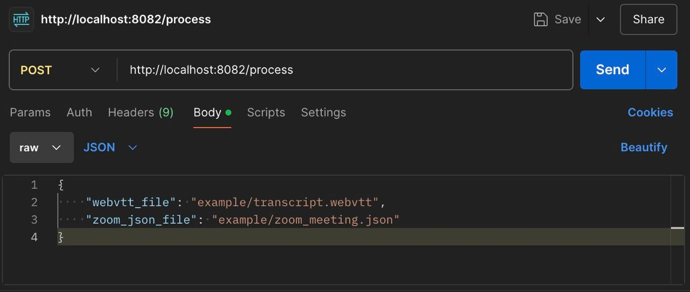

# ZOOM Meeting Analyzer


In the sales process any meeting is a valuable source of information about the customer. Sales executive usually must fill this information into CRM manually. 

Using OpenAI LLM model this Flask application analyses data(.json) and transcript(.webvtt) of the Zoom meeting and updates contacts on Salesforce.

Workflow:
- contacts extraction from zoom json file
- checking if needed participants are already among Salesforce contacts, creating a new ones with basic data if not
-  extracting valuable information about customers with Large Language Models to process Zoom meeting data (meeting information and WEBVTT files). 
- creating/updating records in CRM, taking into account the existing data about the user


## Implementation

There are 4 microservices: SalesforceConnector, MeetingPeopleExtractor, OpenAIClient and Main.

MeetingPeopleExtractor:
- reads .json file about the meeting
- extracts user names and emails
- forms them into fitting json for the next steps
  

SalesforceConnector consists of the methods needed to:
- connect to Salesforce Account (OAuth 2.0)
- create, modify, delete, and read contacts

OpenAIClient:
- sends requests to LLM
- has a structure to form the responses in needed format
- logs info about LLM usage in app_logs/api_calls.log (costs, tokens, tokens/sec, price/token)
- In salesforce_schema.csv you can see all extracted fields that were used in prompts.

Main:
- sends requests to all previous microservices to process the input files
- logs main request responce codes in app_logs/main.log

## Setup

Download the project or clone it from GitHub.

Create .venv and run ```pip install -r requirements.txt```


### Salesforce connection (useful link: [setup](https://www.youtube.com/watch?v=zFcjDQC2nag&ab_channel=JieJenn))
   
- Connect a new app in Salesforce
- allow OAuth 2.0 Authorization
- create a user with integration permissions and add him to the project profile
- in .env fill in the gaps for 
CONSUMER_KEY, CONSUMER_SECRET, USERNAME, PASSWORD, and DOMAIN 


### OpenAI connection:
- create OpenAI API on [openai_api](https://openai.com/index/openai-api/)
- in .env fill in the gap OPEN_AI_API

### Secret
run ```python generate_secret.py``` and paste the generated secret in .env to SECRET_KEY


## Usage

### Starting microservices

run ```python run_all.py```

>>> all services must be started. You are ready to go.

After running all microservices, you can use 2 options to try the app:

1) In ```test_connector.py``` change the paths to files you want to analyse. Run file.

2) In Postman:
Headers:
Content-Type: application/json



## Example:


## Future Improvements:

- Experimenting with paying attention of the model to more fields, then it is in the current prompt template
- Improving security: there are some basics of registering and logging users with heshing and limitation of the calls/hour(day) to avoid attacs and to keep the APIs safe  (part with HTTPS is commented now, some fixes needed)
- users are saved in list, which has to be replaced with DB storage for production version of the project
- Consider local LLMs or choose LLM provider with the needed proof of data security 
- Microservice architecture allows controlling each part separately, so queue integration and parallelizing the requests would improve efficiency.
- Not pass all of the field to LLM(for safety)
- Create visual + deploy with allowwing user to paste his credentials
- fetching data directly from Zoom API, not just analyze downloaded files
- add caching for logs


